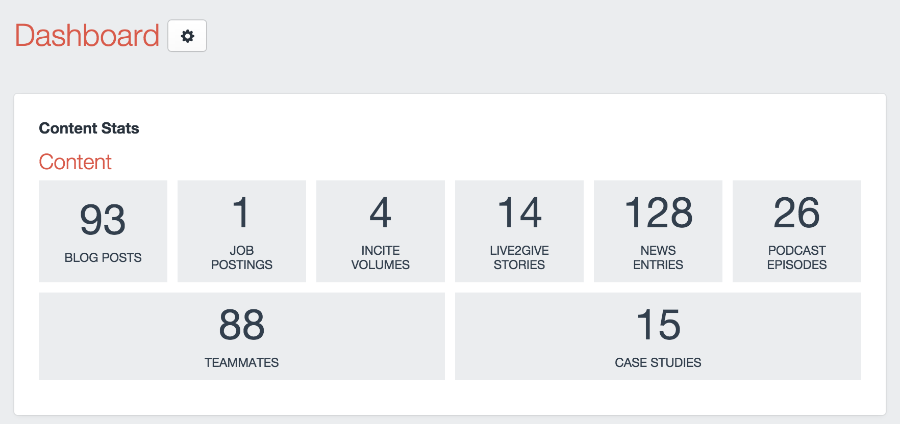
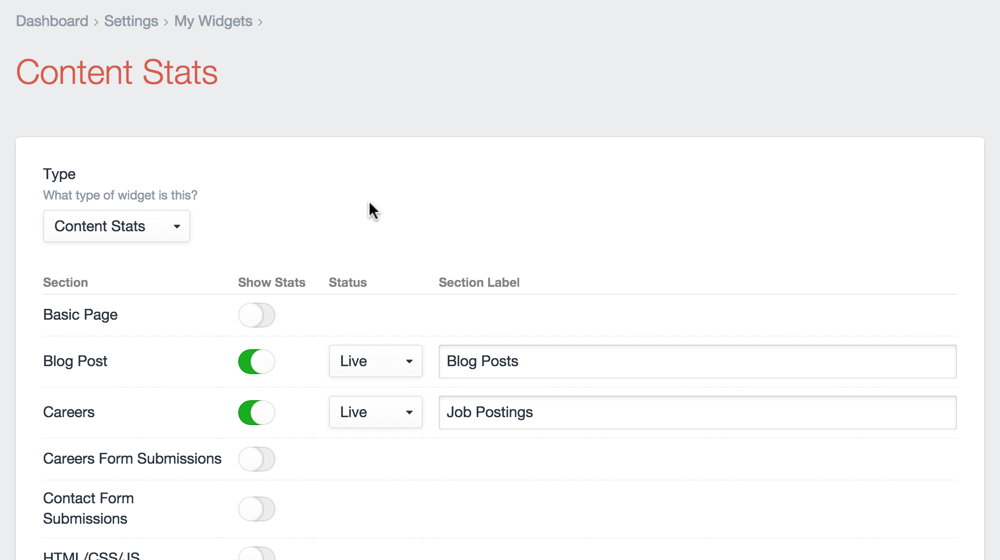

# Craft – Content Stats
See how much content you have per section, in [Craft CMS](https://buildwithcraft.com).

> one point oh!

## Installation
1. Upload the `contentstats/` folder to your `craft/plugins/` folder.
2. Enable the plugin in the CP.
3. Go to your Dashboard and add the Content Stats widget

## For Developers
The sections that show up in the widget settings are based off of each user‘s permission to edit that section. Adding the permission to "Edit entries" will allow that section to appear in the widget for that user.

## Settings

For each section, you can change these settings:
* **Show Stats** – Toggle whether or not this section should appear on the widget.
* **Status** – Select the status that you would like to see appear on the widget (this might be useful for showing hidden form submission entries).
* **Section Label** – Override the label for this section. By default the pattern will be "[Section Name] Entries".

---

## Releases
##### *1.0*
* Initial release of Content Stats widget

Please, let me know if this plugin is useful or if you have any suggestions or issues. [@wbrowar](https://twitter.com/wbrowar)